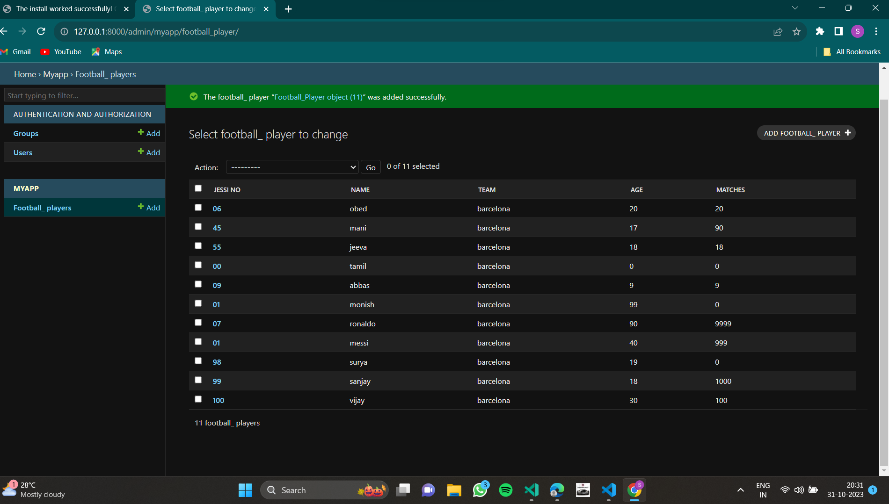

# Ex02 Django ORM Web Application
## Date: 31.10.23

## AIM
To develop a Django application to store and retrieve data from a Football Players database using Object Relational Mapping(ORM).

## DESIGN STEPS

### STEP 1:
Clone the problem from GitHub

### STEP 2:
Create a new app in Django project

### STEP 3:
Enter the code for admin.py and models.py

### STEP 4:
Execute Django admin and create 10 Football players

## PROGRAM
```
Admin.py

from django.contrib import admin
from .models import Football_Player,Football_PlayerAdmin
admin.site.register(Football_Player,Football_PlayerAdmin)

Models.py

from django.db import models
from django.contrib import admin
class Football_Player(models.Model):
    jessi_no=models.CharField(max_length=20,help_text="JESSI NO")
    name=models.CharField(max_length=100)
    Team =models.CharField(max_length=100)
    age=models.IntegerField()
    Matches=models.IntegerField()
class Football_PlayerAdmin(admin.ModelAdmin):
    list_display=('jessi_no','name','Team','age','Matches')

```
## OUTPUT



## RESULT
Thus the program for creating a database using ORM hass been executed successfully
